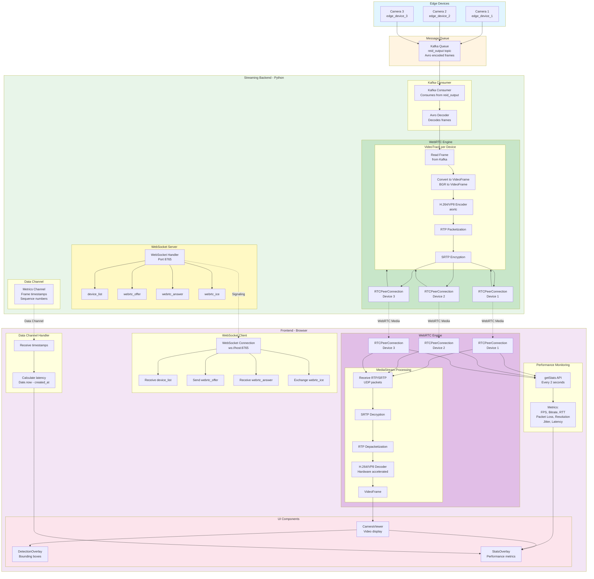

# Complete Guide: ReID Video Streaming System with WebRTC

**Version:** 1.0  
**Last Updated:** 2024  
**Purpose:** Single source of truth for understanding the entire streaming architecture, technologies, and data flow

---

## Table of Contents

1. [System Overview](#system-overview)
2. [Technology Stack](#technology-stack)
3. [Architecture Overview](#architecture-overview)
4. [Component Deep Dive](#component-deep-dive)
5. [Complete Data Flow](#complete-data-flow)
6. [Performance Metrics & Monitoring](#performance-metrics--monitoring)
7. [Why WebRTC vs Alternatives](#why-webrtc-vs-alternatives)
8. [Implementation Details](#implementation-details)
9. [Best Practices](#best-practices)
10. [Troubleshooting Guide](#troubleshooting-guide)

---

## System Overview

### What This System Does

This is a **real-time video streaming system** for Re-identification (ReID) monitoring. It streams live video from multiple edge devices (cameras) to a web dashboard, allowing operators to:

- View live video feeds from multiple cameras simultaneously
- See AI-detected persons with bounding boxes and metadata
- Monitor streaming performance metrics (latency, bitrate, FPS, etc.)
- Interact with detections (click, filter, search)

### Key Requirements

- **Low latency**: < 500ms end-to-end delay for real-time monitoring
- **High quality**: Sharp video with minimal compression artifacts
- **Scalable**: Support multiple concurrent viewers
- **Reliable**: Handle network fluctuations gracefully
- **Interactive**: Overlays, filtering, and real-time updates

---

## Technology Stack

### Backend Technologies

#### 1. **Python 3.x**
- **Role**: Main backend language
- **Why**: Integrates with existing Python-based ReID pipeline (Kafka, OpenCV, ML models)

#### 2. **aiortc** (Python WebRTC Library)
- **Role**: WebRTC peer connection implementation for Python
- **What it does**:
  - Creates `RTCPeerConnection` (equivalent to browser's WebRTC API)
  - Encodes video frames into H.264/VP8/VP9
  - Handles RTP/SRTP packetization
  - Manages ICE candidates and SDP negotiation
- **Installation**: `pip install aiortc`
- **Dependencies**: Requires `ffmpeg` system library

#### 3. **websockets** (Python WebSocket Library)
- **Role**: WebSocket server for signaling
- **What it does**:
  - Creates WebSocket server on `ws://host:port`
  - Handles client connections
  - Exchanges signaling messages (SDP, ICE candidates)
- **Installation**: `pip install websockets`
- **Important**: WebSocket is **ONLY** for signaling, NOT for video data

#### 4. **OpenCV (cv2)**
- **Role**: Video frame reading and processing
- **What it does**:
  - Reads frames from video files or cameras
  - Converts frames to numpy arrays (BGR format)
  - Provides image manipulation utilities
- **Installation**: `pip install opencv-python`

#### 5. **PyAV (av)**
- **Role**: Video frame format conversion
- **What it does**:
  - Converts numpy arrays to `VideoFrame` objects (required by aiortc)
  - Handles frame timing (PTS, time_base)
- **Installation**: `pip install av`

#### 6. **python-dotenv**
- **Role**: Configuration management
- **What it does**: Loads environment variables from `.env` file
- **Installation**: `pip install python-dotenv`

### Frontend Technologies

#### 1. **Next.js 14+** (React Framework)
- **Role**: Web application framework
- **Why**: Server-side rendering, API routes, modern React features

#### 2. **React 18+**
- **Role**: UI component library
- **Features Used**:
  - Hooks (`useState`, `useEffect`, `useRef`, `useCallback`)
  - Component composition
  - State management

#### 3. **WebRTC Browser APIs**
- **Role**: Native browser WebRTC implementation
- **APIs Used**:
  - `RTCPeerConnection`: Manages peer-to-peer connection
  - `MediaStream`: Represents video/audio stream
  - `RTCDataChannel`: Bidirectional data channel (for metrics)
  - `getStats()`: Performance metrics API

#### 4. **WebSocket API** (Browser)
- **Role**: Signaling channel
- **What it does**: Connects to backend WebSocket server for signaling

### Network Protocols

#### 1. **WebSocket (WS/WSS)**
- **Protocol**: TCP-based, full-duplex
- **Role**: Signaling only (SDP exchange, ICE candidates)
- **Port**: Configurable (default: 8765)
- **Message Format**: JSON
- **Important**: Does NOT carry video data

#### 2. **RTP (Real-time Transport Protocol)**
- **Protocol**: UDP-based
- **Role**: Carries encoded video packets
- **Features**:
  - Sequence numbers for ordering
  - Timestamps for synchronization
  - Payload type identification
- **Packet Size**: ~1-10 KB per packet

#### 3. **SRTP (Secure RTP)**
- **Protocol**: Encrypted RTP
- **Role**: Encrypts RTP packets for security
- **Encryption**: AES-128/AES-256
- **Authentication**: HMAC-SHA1

#### 4. **UDP (User Datagram Protocol)**
- **Protocol**: Connectionless, unreliable
- **Role**: Transport for RTP/SRTP packets
- **Why UDP**: Low latency, no head-of-line blocking
- **Trade-off**: Packets can be lost (acceptable for live video)

#### 5. **ICE (Interactive Connectivity Establishment)**
- **Protocol**: NAT traversal protocol
- **Role**: Discovers network paths between peers
- **Components**:
  - **STUN**: Discovers public IP/port
  - **TURN**: Relays traffic if direct connection fails

### Video Codecs

#### 1. **H.264 (AVC)**
- **Type**: Lossy video compression
- **Compression**: Temporal (I/P/B frames) + Spatial (DCT)
- **Advantages**:
  - Excellent compression ratio (5-10x better than JPEG)
  - Hardware acceleration support (GPU decode)
  - Widely supported
- **Bitrate**: Configurable (default: 5 Mbps for 1080p)
- **Latency**: Low (with proper configuration)

#### 2. **VP8**
- **Type**: Open-source video codec
- **Advantages**: Good for low-latency scenarios
- **Usage**: Alternative to H.264 if hardware acceleration not needed

#### 3. **VP9**
- **Type**: Successor to VP8
- **Advantages**: Better compression than VP8
- **Disadvantages**: Higher CPU usage

---

## Architecture Overview

### High-Level Architecture



### Gateway Architecture Decision

**Question**: Do we need a separate gateway between Kafka and the Streaming Backend, or is the Streaming Service itself the gateway?

**Answer**: **The Streaming Backend IS the gateway itself** - this is the recommended approach for your use case.

#### Why Streaming Backend as Gateway Works Best:

1. **Single Responsibility**: The streaming service already needs to:
   - Consume from Kafka (read frames)
   - Transform frames (decode Avro, convert formats)
   - Stream via WebRTC (encode, packetize, send)
   
   Adding a separate gateway would duplicate the Kafka consumption logic.

2. **Lower Latency**: Direct consumption from Kafka → WebRTC reduces:
   - Network hops
   - Serialization/deserialization steps
   - Processing delays

3. **Simpler Architecture**: Fewer moving parts = easier to:
   - Deploy
   - Debug
   - Monitor
   - Scale

4. **Resource Efficiency**: One service handles both:
   - Kafka consumer (lightweight)
   - WebRTC encoding (CPU-intensive)
   
   Better resource utilization than two separate services.

#### When You WOULD Need a Separate Gateway:

Only consider a separate gateway if you need:

1. **Multiple Streaming Protocols**: 
   - Gateway consumes from Kafka once
   - Distributes to multiple streaming services (WebRTC, HLS, DASH)
   - **Your case**: Only WebRTC → No need

2. **Complex Transformation Logic**:
   - Heavy processing (ML inference, transcoding)
   - Multiple transformation pipelines
   - **Your case**: Simple decode + encode → No need

3. **Independent Scaling**:
   - Kafka consumption needs different scale than streaming
   - **Your case**: They scale together → No need

4. **Multi-Tenancy**:
   - Different clients need different processing
   - **Your case**: Single use case → No need

#### Recommended Architecture:

```
Edge Devices → Kafka Queue → Streaming Backend → WebRTC → Frontend
                              (Kafka Consumer + WebRTC Server)
```

**The Streaming Backend acts as:**
- ✅ Kafka Consumer (reads frames)
- ✅ Frame Processor (decodes Avro, converts formats)
- ✅ WebRTC Gateway (encodes, streams to clients)

This is a **common pattern** in streaming systems and perfectly suited for your ReID use case.

### CPU Usage & Horizontal Scaling Considerations

**Question**: The gateway causes CPU usage, and when scaling to more edge devices, we might need to horizontally scale the Gateway. Is that correct? How do we minimize CPU usage?

**Answer**: Yes, you're correct - encoding is CPU-intensive, and horizontal scaling is one solution. However, there are better approaches to minimize CPU usage.

#### CPU Usage Breakdown

**Current Design CPU Usage** (per device stream):

| Operation | CPU Usage | Notes |
|-----------|-----------|-------|
| Kafka Consumer | ~1-2% | Lightweight, mostly I/O |
| Avro Decoding | ~2-5% | Simple deserialization |
| Frame Conversion (BGR → VideoFrame) | ~5-10% | Format conversion |
| **H.264/VP8 Encoding** | **30-60%** | **Most CPU-intensive** |
| RTP Packetization | ~2-5% | Simple packet wrapping |
| WebRTC Signaling | ~1-2% | Minimal overhead |
| **Total per stream** | **~40-85%** | **Depends on resolution/fps** |

**Key Insight**: H.264/VP8 encoding is the bottleneck (~70-80% of total CPU).

#### Scaling Challenge

**Current Architecture** (1:1 encoding per client):
```
Kafka → Streaming Backend → Encode → Client 1
                            → Encode → Client 2
                            → Encode → Client 3
```

**Problem**: Each client connection requires a separate encoding process.

**Example**:
- 10 edge devices × 5 clients each = 50 concurrent encodings
- Each encoding: ~50% CPU
- **Total**: ~2500% CPU = **25 CPU cores needed**

**Yes, horizontal scaling is needed** with current design, but it's inefficient.

#### Solution 1: SFU Pattern (Selective Forwarding Unit) ⭐ RECOMMENDED

**Concept**: Encode once per device, distribute to multiple clients.

**Architecture**:
```
Kafka → Streaming Backend → Encode Once → SFU → Distribute to Clients
                                      (per device)    (no re-encoding)
```

**Benefits**:
- ✅ **Encode once** per device (not per client)
- ✅ **10x CPU reduction** for multiple clients
- ✅ **Lower latency** (no re-encoding delay)
- ✅ **Better scalability** (1 encoding per device, not per client)

**Example**:
- 10 edge devices × 1 encoding each = 10 concurrent encodings
- Each encoding: ~50% CPU
- **Total**: ~500% CPU = **5 CPU cores needed** (vs 25 cores before)
- **Savings**: 80% CPU reduction

**Implementation Options**:

1. **aiortc SFU** (Python):
   ```python
   # Encode once per device
   video_track = VideoTrack(device_id, video_source)
   pc_device = RTCPeerConnection()
   pc_device.addTrack(video_track)
   
   # Forward to multiple clients (no re-encoding)
   for client_pc in client_connections:
       # Forward RTP packets (no encoding)
       forward_rtp_packets(pc_device, client_pc)
   ```

2. **Janus Gateway** (C, more performant):
   - SFU implemented in C (lower CPU)
   - Supports WebRTC forwarding
   - Can handle 1000s of concurrent streams

3. **Kurento Media Server** (Java):
   - SFU capabilities
   - Good for enterprise deployments

**Trade-off**: More complex architecture, but much better CPU efficiency.

#### Solution 2: Hardware Acceleration (GPU Encoding)

**Concept**: Use GPU instead of CPU for encoding.

**Benefits**:
- ✅ **10-50x faster** than CPU encoding
- ✅ **Lower CPU usage** (offloads to GPU)
- ✅ **Better quality** at same bitrate (GPU encoders are optimized)

**Hardware Options**:

1. **NVIDIA NVENC** (NVIDIA GPUs):
   ```python
   # aiortc with hardware acceleration
   # Requires NVIDIA GPU + proper drivers
   # Encoder uses GPU instead of CPU
   ```

2. **Intel QuickSync** (Intel CPUs with integrated GPU):
   ```python
   # Use hardware encoder on Intel GPU
   # Lower power consumption
   ```

3. **AMD VCE** (AMD GPUs):
   ```python
   # AMD hardware encoder
   ```

**Requirements**:
- GPU with hardware encoder support
- Proper drivers installed
- aiortc/ffmpeg compiled with hardware support

**CPU Reduction**: ~80-95% reduction in CPU usage for encoding.

#### Solution 3: Optimize Encoder Settings

**Concept**: Reduce encoding complexity without sacrificing too much quality.

**Settings to Adjust**:

1. **Preset** (speed vs quality):
   ```python
   # Faster preset = lower CPU, slightly lower quality
   # Slower preset = higher CPU, better quality
   # Use "veryfast" or "faster" preset
   ```

2. **Resolution**:
   ```python
   # Lower resolution = less CPU
   # 720p instead of 1080p = ~50% CPU reduction
   ```

3. **Frame Rate**:
   ```python
   # Lower FPS = less CPU
   # 30 FPS instead of 60 FPS = ~50% CPU reduction
   ```

4. **Bitrate**:
   ```python
   # Lower bitrate = slightly less CPU
   # But quality trade-off
   ```

**Example Optimization**:
- Before: 1080p@60fps, "medium" preset → ~60% CPU per stream
- After: 720p@30fps, "veryfast" preset → ~15% CPU per stream
- **Savings**: 75% CPU reduction

#### Solution 4: Separate Encoding from Distribution

**Architecture**:
```
Kafka → Encoder Service → Encoded Stream Storage → Streaming Backend → Clients
        (CPU-intensive)      (Redis/Kafka)         (Lightweight)
```

**Benefits**:
- ✅ **Independent scaling**: Scale encoders separately from distributors
- ✅ **Better resource utilization**: Encoders on CPU-heavy machines, distributors on network-heavy machines
- ✅ **Resilience**: If distributor fails, encoding continues

**Trade-off**: Higher latency (extra hop), more complex architecture.

#### Solution 5: Hybrid Approach (Best of Both Worlds)

**Recommended Architecture**:

```
┌─────────────────────────────────────────────────────────────┐
│  Kafka Queue                                                │
└──────────────────┬──────────────────────────────────────────┘
                   │
                   ▼
┌─────────────────────────────────────────────────────────────┐
│  Encoding Layer (CPU-Optimized)                            │
│  - Hardware acceleration (GPU/NVENC)                       │
│  - SFU pattern (encode once per device)                    │
│  - Optimized encoder settings                              │
└──────────────────┬──────────────────────────────────────────┘
                   │
                   ▼
┌─────────────────────────────────────────────────────────────┐
│  Distribution Layer (Lightweight)                         │
│  - Forward RTP packets (no encoding)                        │
│  - Handle WebRTC signaling                                 │
│  - Manage client connections                               │
└──────────────────┬──────────────────────────────────────────┘
                   │
                   ▼
┌─────────────────────────────────────────────────────────────┐
│  Frontend Clients                                           │
└─────────────────────────────────────────────────────────────┘
```

**CPU Usage**:
- Encoding Layer: ~5-10% CPU per device (with hardware acceleration + SFU)
- Distribution Layer: ~1-2% CPU per client (just forwarding)
- **Total**: Much lower than current design

#### Comparison: CPU Usage Scenarios

**Scenario**: 10 edge devices, 5 clients per device = 50 total clients

| Solution | Encoding CPU | Distribution CPU | Total CPU | Cores Needed |
|----------|-------------|------------------|-----------|--------------|
| **Current (1:1 encoding)** | 50 × 50% = 2500% | 50 × 2% = 100% | **2600%** | **26 cores** |
| **SFU Pattern** | 10 × 50% = 500% | 50 × 2% = 100% | **600%** | **6 cores** |
| **SFU + Hardware Accel** | 10 × 5% = 50% | 50 × 2% = 100% | **150%** | **2 cores** |
| **SFU + Hardware + Optimized** | 10 × 3% = 30% | 50 × 2% = 100% | **130%** | **2 cores** |

**Savings**: Up to **95% CPU reduction** with optimal solution.

#### Recommendations for Your Use Case

**Phase 1: Immediate Optimizations** (Easy wins):
1. ✅ **Optimize encoder settings**: Use "veryfast" preset, reduce resolution/fps if acceptable
2. ✅ **Monitor CPU usage**: Profile to identify bottlenecks
3. ✅ **Horizontal scaling**: Add more gateway instances (short-term solution)

**Phase 2: SFU Implementation** (Medium effort, high impact):
1. ✅ **Implement SFU pattern**: Encode once per device, distribute to clients
2. ✅ **Use aiortc SFU** or **Janus Gateway** for forwarding
3. ✅ **Expected CPU reduction**: 70-80%

**Phase 3: Hardware Acceleration** (Best performance):
1. ✅ **Add GPU support**: NVIDIA GPU with NVENC
2. ✅ **Configure hardware encoder**: Modify aiortc/ffmpeg settings
3. ✅ **Expected CPU reduction**: 90-95%

**Phase 4: Production Architecture** (Long-term):
1. ✅ **Separate encoding from distribution**: Independent scaling
2. ✅ **Load balancing**: Distribute clients across multiple gateway instances
3. ✅ **Monitoring**: Track CPU usage, scale automatically

#### Implementation Priority

**For your ReID system**:

1. **Short-term** (1-2 weeks):
   - Optimize encoder settings
   - Horizontal scaling (add more gateway instances)
   - Monitor CPU usage

2. **Medium-term** (1-2 months):
   - Implement SFU pattern
   - Encode once per device
   - Distribute to multiple clients

3. **Long-term** (3-6 months):
   - Add hardware acceleration (if budget allows)
   - Separate encoding/distribution layers
   - Auto-scaling based on load

#### Summary

- ✅ **Yes, horizontal scaling is needed** with current design
- ✅ **But it's inefficient** - each client requires separate encoding
- ✅ **Better solution**: SFU pattern (encode once, distribute many)
- ✅ **Best solution**: SFU + Hardware acceleration
- ✅ **Expected CPU reduction**: 70-95% with optimal solution
- ✅ **Current design is fine for small scale** (< 10 devices, < 20 clients)
- ⚠️ **For production scale**: Implement SFU pattern or hardware acceleration

### Component Relationships

1. **Backend ↔ Frontend**: Two separate channels
   - **WebSocket**: Signaling (SDP, ICE)
   - **WebRTC**: Media stream (RTP/SRTP)

2. **One WebSocket connection** per frontend client
3. **Multiple RTCPeerConnections** per client (one per device)
4. **One VideoTrack** per device (on backend)
5. **One MediaStream** per device (on frontend)

### Data Channel vs Video Stream: Timing Characteristics

**Question**: Are metrics sent through Data Channel alongside video in RTCPeerConnection? Will they arrive at different speeds and cause delays?

**Answer**: Yes, metrics are sent via Data Channel in the same RTCPeerConnection, but they use different transport protocols with different characteristics.

#### How It Works Currently:

1. **Video Stream** (RTP/SRTP):
   - Protocol: RTP over UDP (unreliable, unordered)
   - Packet size: ~1-10 KB per packet
   - Characteristics: Can drop packets, arrive out of order
   - Purpose: Video frames

2. **Data Channel** (Metrics):
   - Protocol: SCTP over DTLS (reliable, ordered by default)
   - Message size: ~50-100 bytes per message
   - Characteristics: Guaranteed delivery, in-order delivery
   - Purpose: Frame timestamps for latency measurement

#### Timing Differences:

**Yes, they can arrive at different speeds** due to:

1. **Different Protocols**:
   - RTP (UDP): Best-effort, can be dropped
   - SCTP (Data Channel): Reliable, retransmits if lost

2. **Different Priorities**:
   - Video packets: Higher priority in network queues
   - Data Channel: Lower priority (small messages)

3. **Different Buffering**:
   - Video: Jitter buffer (can delay for smooth playback)
   - Data Channel: Minimal buffering (immediate delivery)

4. **Network Conditions**:
   - Congestion affects UDP (video) more than SCTP (data channel)
   - Packet loss affects video more (UDP doesn't retransmit)

#### Is This a Problem?

**For latency measurement: NO** - This design is actually fine because:

1. **Latency doesn't need frame-perfect sync**:
   - We're measuring end-to-end delay (backend timestamp → frontend receive)
   - Small timing differences (< 50ms) are acceptable
   - The metric is averaged over time anyway

2. **Data Channel is typically faster**:
   - Smaller messages = less network time
   - Reliable delivery = no retransmission delays
   - Usually arrives before or with the corresponding video frame

3. **Sequence numbers help**:
   - Each timestamp message includes `seq` number matching the video frame
   - Frontend can match timestamps to frames if needed (future enhancement)

#### When It COULD Be a Problem:

1. **If you need frame-perfect synchronization**:
   - Example: Overlaying detection metadata on specific frames
   - Solution: Use sequence numbers to match timestamps to frames

2. **If Data Channel is significantly slower**:
   - Rare, but possible with network congestion
   - Solution: Use `ordered: false` for lower latency (accept out-of-order)

3. **If you need sub-frame accuracy**:
   - Current: ~16-33ms accuracy (one frame at 30-60 FPS)
   - Solution: Would need frame-level synchronization (more complex)

#### Current Implementation Analysis:

```python
# Backend: VideoTrack.recv()
frame = VideoFrame.from_ndarray(img, format="bgr24")
frame.pts = self._pts  # Sequence number

# Send timestamp via Data Channel (same call, same frame)
channel.send(json.dumps({
    "type": "frame_ts",
    "created_at": int(time.time() * 1000),
    "seq": self._pts  # Matches frame.pts
}))
```

**Timing**: Timestamp is sent **immediately after** frame is created, so:
- They share the same network path (same RTCPeerConnection)
- Data Channel message is tiny (faster to send)
- Usually arrives before or with the video frame

#### Recommendations:

**Current approach is good for latency measurement**, but if you need better synchronization:

1. **Add sequence number matching** (if not already):
   ```typescript
   // Store timestamps by sequence number
   const timestampMap = new Map<number, number>()
   
   dc.onmessage = (ev) => {
       const msg = JSON.parse(ev.data)
       timestampMap.set(msg.seq, msg.created_at)
   }
   
   // When video frame arrives, match by seq
   videoElement.ontimeupdate = () => {
       const currentSeq = getCurrentFrameSeq(videoElement)
       const timestamp = timestampMap.get(currentSeq)
       if (timestamp) {
           const latency = Date.now() - timestamp
       }
   }
   ```

2. **Use ordered Data Channel** (default):
   - Ensures messages arrive in order
   - Matches video frame sequence

3. **Accept small timing differences**:
   - For latency measurement, ±50ms is acceptable
   - The metric is for monitoring, not frame-perfect sync

#### Summary:

- ✅ **Metrics ARE sent via Data Channel** alongside video in the same RTCPeerConnection
- ✅ **They CAN arrive at different speeds**, but this is **not a problem** for latency measurement
- ✅ **Data Channel is typically faster** (smaller messages, reliable)
- ⚠️ **If you need frame-perfect sync** (e.g., detection overlays), use sequence number matching
- ✅ **Current design is appropriate** for your use case (performance monitoring)

---

## Component Deep Dive

### Backend Components

#### 1. WebSocket Server (`websockets.serve`)

**Location**: `backend/mock_ws.py`

**Purpose**: Handles signaling between backend and frontend

**Key Methods**:
```python
async def handler(self, ws: WebSocketServerProtocol):
    # Send device list on connection
    await self._send_json(ws, {"type": "device_list", "devices": [...]})
    
    # Handle incoming messages
    async for message in ws:
        data = json.loads(message)
        if data["type"] == "webrtc_offer":
            await self._handle_webrtc_offer(ws, data)
        elif data["type"] == "webrtc_ice":
            await self._handle_webrtc_ice(ws, data)
```

**Message Types**:
- `device_list`: Backend → Frontend (list of available devices)
- `webrtc_offer`: Frontend → Backend (SDP offer)
- `webrtc_answer`: Backend → Frontend (SDP answer)
- `webrtc_ice`: Frontend ↔ Backend (ICE candidates)

**Configuration**:
- Host: `WEBSOCKET_HOST` (default: `0.0.0.0`)
- Port: `WEBSOCKET_PORT` (default: `8765`)

#### 2. RTCPeerConnection (Backend)

**Library**: `aiortc.RTCPeerConnection`

**Purpose**: Manages WebRTC peer connection on backend

**Lifecycle**:
1. **Create**: `pc = RTCPeerConnection()`
2. **Add Track**: `pc.addTrack(video_track)`
3. **Set Remote Description**: `await pc.setRemoteDescription(offer)`
4. **Create Answer**: `answer = await pc.createAnswer()`
5. **Set Local Description**: `await pc.setLocalDescription(answer)`
6. **ICE Gathering**: Wait for `iceGatheringState == "complete"`
7. **Send Answer**: Send SDP answer to frontend via WebSocket

**Key Features**:
- **Codec Selection**: Prefers H.264, falls back to VP8/VP9
- **Bitrate Control**: Configurable max bitrate (default: 5 Mbps)
- **Data Channel Support**: Can create data channels for metadata

#### 3. VideoTrack (MediaStreamTrack)

**Location**: `backend/mock_ws.py` (inside `_handle_webrtc_offer`)

**Purpose**: Source of video frames for WebRTC stream

**Implementation**:
```python
class VideoTrack(MediaStreamTrack):
    kind = "video"
    
    async def recv(self):
        # Read frame from source (file/camera/Kafka)
        ok, img = self.cap.read()
        
        # Convert to VideoFrame
        frame = VideoFrame.from_ndarray(img, format="bgr24")
        
        # Set timing
        frame.pts = self._pts
        frame.time_base = Fraction(1, fps)
        
        # Send timestamp via data channel (for latency measurement)
        if data_channel:
            channel.send(json.dumps({
                "type": "frame_ts",
                "created_at": int(time.time() * 1000),
                "seq": self._pts
            }))
        
        self._pts += 1
        return frame
```

**Frame Source Options**:
1. **Video File**: `cv2.VideoCapture(video_path)`
2. **Camera**: `cv2.VideoCapture(0)` or `cv2.VideoCapture("rtsp://...")`
3. **Kafka**: Read from Kafka consumer, decode image bytes

**Frame Rate Control**:
- Uses `frame_interval = 1.0 / fps` to pace frames
- Sleeps if frame arrives too early

#### 4. Data Channel (Backend)

**Purpose**: Send metadata alongside video stream

**Usage**:
- Frame timestamps (for latency measurement)
- Sequence numbers
- Future: Detection metadata (bounding boxes, track IDs)

**Implementation**:
```python
@pc.on("datachannel")
def on_datachannel(channel):
    if channel.label == "metrics":
        self._data_channels[device_id] = channel

# In VideoTrack.recv():
channel = self.server._data_channels.get(device_id)
if channel and channel.readyState == "open":
    channel.send(json.dumps({
        "type": "frame_ts",
        "created_at": int(time.time() * 1000),
        "seq": self._pts
    }))
```

### Frontend Components

#### 1. WebSocket Client

**Location**: `hooks/use-streaming.ts`

**Purpose**: Connects to backend WebSocket server for signaling

**Connection Flow**:
```typescript
const wsUrl = process.env.NEXT_PUBLIC_WS_URL || "ws://localhost:8765"
const ws = new WebSocket(wsUrl)

ws.onopen = () => {
    setIsConnected(true)
}

ws.onmessage = (event) => {
    const data = JSON.parse(event.data)
    
    switch (data.type) {
        case "device_list":
            setDevices(data.devices)
            // Start WebRTC for each device
            data.devices.forEach(startWebRTCForDevice)
            break
        case "webrtc_answer":
            // Set remote description
            pc.setRemoteDescription(new RTCSessionDescription(data.sdp))
            break
        case "webrtc_ice":
            // Add ICE candidate
            pc.addIceCandidate(data.candidate)
            break
    }
}
```

**Reconnection Logic**:
- Exponential backoff (1s → 2s → 4s → ... → max 30s)
- Max attempts: 10
- Manual reconnect available

#### 2. RTCPeerConnection (Frontend)

**Location**: `hooks/use-streaming.ts` (`startWebRTCForDevice`)

**Purpose**: Manages WebRTC connection per device

**Lifecycle**:
```typescript
const pc = new RTCPeerConnection({
    iceServers: [{ urls: ["stun:stun.l.google.com:19302"] }]
})

// Create data channel (for metrics)
const dc = pc.createDataChannel("metrics")
dc.onmessage = (ev) => {
    const msg = JSON.parse(ev.data)
    if (msg.type === "frame_ts") {
        const latencyMs = Date.now() - msg.created_at
        // Update stats
    }
}

// Handle incoming video stream
pc.ontrack = (ev) => {
    const stream = ev.streams[0]
    setMediaStreams(prev => {
        const next = new Map(prev)
        next.set(deviceId, stream)
        return next
    })
}

// Create offer
pc.addTransceiver("video", { direction: "recvonly" })
const offer = await pc.createOffer()
await pc.setLocalDescription(offer)

// Send offer via WebSocket
ws.send(JSON.stringify({
    type: "webrtc_offer",
    device_id: deviceId,
    sdp: pc.localDescription
}))

// Handle ICE candidates
pc.onicecandidate = (ev) => {
    if (ev.candidate) {
        ws.send(JSON.stringify({
            type: "webrtc_ice",
            device_id: deviceId,
            candidate: ev.candidate
        }))
    }
}
```

#### 3. Performance Monitoring (`getStats()`)

**Location**: `hooks/use-streaming.ts` (inside `startWebRTCForDevice`)

**Purpose**: Collect real-time performance metrics

**Metrics Collected**:
```typescript
const stats = await pc.getStats()

stats.forEach((report) => {
    // Inbound RTP (video stream)
    if (report.type === "inbound-rtp" && report.kind === "video") {
        fps = report.framesPerSecond
        bitrateKbps = (report.bytesReceived - prevBytes) * 8 / timeDelta / 1000
        packetLossPct = report.packetsLost / (report.packetsLost + report.packetsReceived) * 100
        width = report.frameWidth
        height = report.frameHeight
        jitterMs = report.jitter * 1000
    }
    
    // Candidate pair (connection quality)
    if (report.type === "candidate-pair" && report.state === "succeeded") {
        rttMs = report.currentRoundTripTime * 1000
    }
})
```

**Update Frequency**: Every 2 seconds

**Metrics Exposed**:
- **FPS**: Frames per second (actual received)
- **Bitrate**: Kilobits per second
- **RTT**: Round-trip time (ms)
- **Packet Loss**: Percentage
- **Resolution**: Width × Height
- **Jitter**: Timing variation (ms)
- **Latency**: End-to-end delay (ms, from data channel)

#### 4. Video Display (`<video>` Element)

**Location**: `components/camera-viewer.tsx`

**Purpose**: Renders video stream in browser

**Implementation**:
```tsx
<video
    ref={(el) => {
        if (el && mediaStream && el.srcObject !== mediaStream) {
            el.srcObject = mediaStream
        }
    }}
    autoPlay
    playsInline
    muted
    className="w-full h-full object-contain"
/>
```

**Key Properties**:
- `srcObject`: Assigns MediaStream (not `src` URL)
- `autoPlay`: Starts playback automatically
- `playsInline`: Prevents fullscreen on mobile
- `muted`: Required for autoplay in some browsers
- `object-contain`: Fits video within container (no cropping)

**Browser Processing**:
1. Receives RTP/SRTP packets
2. Decrypts (SRTP)
3. Depacketizes (RTP → H.264 bitstream)
4. Decodes H.264 (hardware-accelerated if available)
5. Renders to video element

---

## Complete Data Flow

### Phase 1: Connection Establishment (Signaling)

```
┌──────────┐                                    ┌──────────┐
│ Frontend │                                    │ Backend  │
└────┬─────┘                                    └────┬─────┘
     │                                               │
     │ 1. WebSocket Connect                          │
     │──────────────────────────────────────────────>│
     │                                               │
     │ 2. device_list                                │
     │<──────────────────────────────────────────────│
     │  {"type": "device_list",                      │
     │   "devices": ["edge_device_1", ...]}          │
     │                                               │
     │ 3. Create RTCPeerConnection (per device)     │
     │    Create DataChannel ("metrics")            │
     │    Create Offer                              │
     │                                               │
     │ 4. webrtc_offer                               │
     │──────────────────────────────────────────────>│
     │  {"type": "webrtc_offer",                     │
     │   "device_id": "edge_device_1",              │
     │   "sdp": {...}}                               │
     │                                               │
     │ 5. Create RTCPeerConnection                  │
     │    Create VideoTrack                          │
     │    Set Remote Description                    │
     │    Create Answer                             │
     │                                               │
     │ 6. webrtc_answer                              │
     │<──────────────────────────────────────────────│
     │  {"type": "webrtc_answer",                    │
     │   "device_id": "edge_device_1",              │
     │   "sdp": {...}}                               │
     │                                               │
     │ 7. Set Remote Description                    │
     │                                               │
     │ 8. ICE Candidate Exchange (multiple)          │
     │<──────────────────────────────────────────────>│
     │  {"type": "webrtc_ice",                       │
     │   "device_id": "edge_device_1",              │
     │   "candidate": {...}}                        │
     │                                               │
     │ 9. ICE Connection Established                 │
     │    WebRTC connection ready                    │
     │                                               │
```

### Phase 2: Video Streaming (Media Path)

```
┌──────────┐                                    ┌──────────┐
│ Backend  │                                    │ Frontend │
└────┬─────┘                                    └────┬─────┘
     │                                               │
     │ Video Source (File/Camera/Kafka)             │
     │      ↓                                       │
     │ cv2.VideoCapture.read()                     │
     │      ↓                                       │
     │ numpy array (BGR)                           │
     │      ↓                                       │
     │ VideoFrame.from_ndarray()                   │
     │      ↓                                       │
     │ VideoFrame (PTS, time_base)                │
     │      ↓                                       │
     │ aiortc H.264 Encoder                       │
     │      ↓                                       │
     │ H.264 Bitstream                            │
     │      ↓                                       │
     │ RTP Packetization                          │
     │      ↓                                       │
     │ RTP Packets (~1-10 KB each)                │
     │      ↓                                       │
     │ SRTP Encryption                            │
     │      ↓                                       │
     │ UDP Transmission                           │
     │──────────────────────────────────────────────>│
     │                                               │
     │                                    SRTP Decryption
     │                                           ↓
     │                                    RTP Depacketization
     │                                           ↓
     │                                    H.264 Bitstream
     │                                           ↓
     │                                    Browser H.264 Decoder
     │                                           ↓
     │                                    VideoFrame
     │                                           ↓
     │                                    <video> element
     │                                           ↓
     │                                    Display on screen
```

### Phase 3: Metrics Collection (Data Channel)

```
┌──────────┐                                    ┌──────────┐
│ Backend  │                                    │ Frontend │
└────┬─────┘                                    └────┬─────┘
     │                                               │
     │ In VideoTrack.recv():                        │
     │      ↓                                       │
     │ Send timestamp via DataChannel               │
     │──────────────────────────────────────────────>│
     │  {"type": "frame_ts",                        │
     │   "created_at": 1234567890,                 │
     │   "seq": 42}                                 │
     │                                               │
     │                                    Calculate latency:
     │                                    latencyMs = Date.now() - created_at
     │                                           ↓
     │                                    Update statsMap
     │                                           ↓
     │                                    Display in UI overlay
```

### Phase 4: Performance Monitoring (getStats API)

```
Frontend (every 2 seconds):
     │
     │ pc.getStats()
     │      ↓
     │ Stats Report Collection
     │      ↓
     │ Extract metrics:
     │   - inbound-rtp: fps, bitrate, packetLoss, resolution, jitter
     │   - candidate-pair: rtt
     │      ↓
     │ Update statsMap
     │      ↓
     │ Pass to CameraViewer component
     │      ↓
     │ Display in stats overlay
```

---

## Performance Metrics & Monitoring

### Key Metrics Explained

#### 1. **End-to-End Latency**

**Definition**: Time from frame capture (backend) to display (frontend)

**Measurement**:
- Backend sends `created_at` timestamp via data channel
- Frontend receives timestamp and calculates: `latencyMs = Date.now() - created_at`

**Target**: < 500ms for real-time monitoring

**Factors Affecting Latency**:
- Encoding delay (H.264 encoding time)
- Network RTT
- Decoding delay (browser decode time)
- Jitter buffer delay

**How to Improve**:
- Lower encoding complexity (faster preset)
- Reduce jitter buffer size
- Use hardware acceleration
- Optimize network path (reduce hops)

#### 2. **FPS (Frames Per Second)**

**Definition**: Actual frames per second received and displayed

**Measurement**: `getStats()` → `inbound-rtp.framesPerSecond`

**Target**: Match source FPS (e.g., 30 FPS for 30 FPS source)

**Factors Affecting FPS**:
- Source frame rate
- Network bandwidth
- CPU/GPU performance
- Browser rendering performance

**How to Improve**:
- Ensure sufficient bandwidth
- Use hardware acceleration
- Reduce resolution if needed
- Optimize browser rendering

#### 3. **Bitrate**

**Definition**: Data rate of video stream (kilobits per second)

**Measurement**: `getStats()` → Calculate from `bytesReceived` delta over time

**Formula**: `bitrateKbps = (bytesReceived_new - bytesReceived_old) * 8 / timeDelta / 1000`

**Target**: 2-5 Mbps for 1080p@30fps (depends on codec and quality)

**Factors Affecting Bitrate**:
- Resolution (higher = more bitrate)
- Frame rate (higher = more bitrate)
- Codec (H.264 vs VP8/VP9)
- Content complexity (motion, detail)
- Encoder settings (quality preset)

**How to Control**:
- Set `maxBitrate` in encoder parameters
- Adjust resolution/frame rate
- Use adaptive bitrate (WebRTC does this automatically)

#### 4. **RTT (Round-Trip Time)**

**Definition**: Time for packet to travel from client to server and back

**Measurement**: `getStats()` → `candidate-pair.currentRoundTripTime * 1000`

**Target**: < 100ms for good quality

**Factors Affecting RTT**:
- Physical distance
- Network congestion
- Number of network hops
- NAT/firewall traversal

**How to Improve**:
- Use geographically close servers
- Optimize network routing
- Use TURN server if NAT traversal is slow

#### 5. **Packet Loss**

**Definition**: Percentage of packets lost in transit

**Measurement**: `getStats()` → `packetsLost / (packetsLost + packetsReceived) * 100`

**Target**: < 1% for good quality

**Factors Affecting Packet Loss**:
- Network congestion
- Unreliable network (WiFi, mobile)
- Firewall/NAT issues

**How to Improve**:
- Increase bandwidth
- Use more reliable network (wired vs WiFi)
- WebRTC adaptive bitrate (reduces bitrate when loss detected)

#### 6. **Resolution**

**Definition**: Video frame dimensions (width × height)

**Measurement**: `getStats()` → `inbound-rtp.frameWidth` × `frameHeight`

**Common Resolutions**:
- 640×480 (480p)
- 1280×720 (720p)
- 1920×1080 (1080p)

**Factors Affecting Resolution**:
- Source resolution
- Encoder settings
- Adaptive bitrate (may reduce resolution)

#### 7. **Jitter**

**Definition**: Variation in packet arrival times

**Measurement**: `getStats()` → `inbound-rtp.jitter * 1000` (ms)

**Target**: < 30ms

**Factors Affecting Jitter**:
- Network congestion
- Variable network latency
- Router buffering

**How to Improve**:
- Use jitter buffer (WebRTC does this automatically)
- Optimize network path
- Reduce network congestion

### Metrics Display

**Location**: `components/camera-viewer.tsx`

**UI Overlay**:
```tsx
{stats && (
    <div className="absolute top-2 left-2 z-10 bg-black/70 text-white text-xs">
        <div>Transport: {stats.transport}</div>
        {stats.bitrateKbps && <div>Bitrate: {Math.round(stats.bitrateKbps)} kbps</div>}
        {stats.fps && <div>FPS: {Math.round(stats.fps)}</div>}
        {stats.latencyMs && <div>Latency: {Math.round(stats.latencyMs)} ms</div>}
        {stats.rttMs && <div>RTT: {Math.round(stats.rttMs)} ms</div>}
        {stats.packetLossPct && <div>Loss: {stats.packetLossPct.toFixed(1)}%</div>}
        {stats.width && stats.height && (
            <div>Res: {stats.width}×{stats.height}</div>
        )}
    </div>
)}
```

---

## Why WebRTC vs Alternatives

### Comparison: WebRTC vs JSON/HTTP/WebSocket

| Aspect | JSON/HTTP/WebSocket | WebRTC | Why WebRTC is Better |
|--------|-------------------|--------|---------------------|
| **Transport** | TCP (WebSocket) | UDP (RTP/SRTP) | No head-of-line blocking, lower latency |
| **Format** | JPEG (base64) | H.264/VP8/VP9 | 5-10x better compression |
| **Latency** | 500-2000ms | 100-500ms | 2-4x lower latency |
| **Bandwidth** | 6-48 Mbps | 1-5 Mbps | 5-10x less bandwidth |
| **Adaptive Bitrate** | None | Automatic (GCC) | Smooth playback on variable networks |
| **Hardware Acceleration** | Software decode | GPU decode | Lower CPU, faster decode |
| **Frame Timing** | Manual pacing | RTP timestamps | Smooth, consistent frame rate |
| **Scalability** | 1 stream per client | 1 stream, multiple clients | Better for multiple viewers |

### Technical Reasons

#### 1. **UDP vs TCP**

**TCP (WebSocket)**:
- Guarantees delivery (retransmits lost packets)
- **Problem**: If packet #5 is lost, TCP blocks until #5 arrives → **head-of-line blocking**
- **Result**: High latency, stuttering when network is bad

**UDP (WebRTC)**:
- No blocking: Lost packets are dropped, newer packets continue
- **Result**: Lower latency, smoother playback (you see frame N+1 even if frame N was lost)
- **Trade-off**: Accepts some packet loss for lower latency (good for live video)

#### 2. **Codec Efficiency: H.264 vs JPEG**

**JPEG**:
- Compression: Only spatial (within a single frame)
- No temporal compression: Each frame is independent
- Size: ~200-500 KB per frame at 1920×1080

**H.264**:
- Temporal compression: References previous frames (I-frames, P-frames, B-frames)
- Spatial compression: Better algorithms than JPEG
- Size: ~5-50 KB per frame (depends on bitrate, motion)
- **Result**: **5-10x smaller** for similar visual quality

**Example at 30 FPS**:
- JPEG: 200 KB × 30 = **6 MB/s** (48 Mbps)
- H.264 (2 Mbps bitrate): **2 Mbps** = **0.25 MB/s**
- **Savings**: ~24x less bandwidth

#### 3. **Adaptive Bitrate (Congestion Control)**

**Before (JSON/HTTP)**:
- Fixed JPEG quality → fixed bandwidth usage
- Network congestion → frames stall or timeout
- No adaptation

**Now (WebRTC)**:
- **Built-in congestion control** (GCC - Google Congestion Control):
  - Monitors packet loss, RTT, jitter
  - **Automatically reduces bitrate** when network is congested
  - **Increases bitrate** when network improves
- **Result**: Smooth playback even on variable networks

**How it works**:
1. Encoder starts at high bitrate (e.g., 5 Mbps)
2. Network congestion detected (high loss/RTT) → encoder reduces to 2 Mbps
3. Network improves → encoder ramps back up to 4 Mbps
4. All **automatic** - no manual intervention needed

#### 4. **Lower Latency: Multiple Factors**

**1. UDP vs TCP**:
- TCP retransmission adds 100-500 ms per lost packet
- UDP drops lost packets → **0 ms added latency** (but you might see a brief glitch)

**2. No HTTP overhead**:
- HTTP headers, base64 encoding/decoding add ~10-50 ms
- WebRTC: Direct binary RTP packets → **minimal overhead**

**3. Hardware acceleration**:
- Modern browsers/GPUs can **hardware-decode H.264** (faster than software JPEG decode)
- **Result**: Lower CPU usage, faster display

**4. Jitter buffer**:
- WebRTC has built-in jitter buffer (smooths out network timing variations)
- **Result**: More consistent frame timing

**Typical latency improvement**:
- **JSON/HTTP**: 500-2000 ms
- **WebRTC**: 100-500 ms (often 2-4x better)

#### 5. **Better Frame Timing & Synchronization**

**Before (JSON/HTTP)**:
- Manual frame pacing (you control `setInterval` or `requestAnimationFrame`)
- Network jitter → uneven frame intervals → stuttering

**Now (WebRTC)**:
- **RTP timestamps**: Each packet has a timestamp (PTS - Presentation Time Stamp)
- **Jitter buffer**: Smooths out network timing variations
- **Playback clock**: Browser uses RTP timestamps to play frames at correct time
- **Result**: Smooth, consistent frame rate

---

## Implementation Details

### Backend Implementation

#### File Structure
```
backend/
  └── mock_ws.py          # Main streaming server
```

#### Key Classes

**MockStreamingServer**:
- Manages WebSocket server
- Handles multiple devices
- Creates RTCPeerConnection per device
- Manages VideoTrack instances

**VideoTrack (MediaStreamTrack)**:
- Reads frames from source (file/camera/Kafka)
- Converts to VideoFrame
- Sends timestamps via data channel
- Returns frames to aiortc encoder

#### Configuration (`.env`)

```bash
# WebSocket Server
WEBSOCKET_HOST=0.0.0.0
WEBSOCKET_PORT=8765

# Devices
MOCK_DEVICE_IDS=edge_device_1,edge_device_2,edge_device_3
MOCK_VIDEO_PATHS=/path/to/video1.mp4,/path/to/video2.mp4

# Quality Settings
MOCK_FPS=50
MOCK_JPEG_QUALITY=90
MOCK_RTC_MAX_BITRATE=5000000  # 5 Mbps
MOCK_RTC_CODEC=H264
```

#### Running Backend

```bash
cd reid-stream-observer
python3 -m venv .venv
source .venv/bin/activate
pip install aiortc websockets opencv-python av numpy python-dotenv
python3 backend/mock_ws.py
```

### Frontend Implementation

#### File Structure
```
hooks/
  └── use-streaming.ts     # WebRTC/WebSocket hook
components/
  ├── dashboard.tsx        # Main dashboard
  ├── camera-viewer.tsx   # Video display component
  └── detection-overlay.tsx  # Bounding boxes (future)
```

#### Key Hooks

**useStreaming()**:
- Manages WebSocket connection
- Creates RTCPeerConnection per device
- Collects performance metrics
- Exposes: `isConnected`, `devices`, `mediaStreams`, `statsMap`

#### Configuration (`.env.local`)

```bash
NEXT_PUBLIC_WS_URL=ws://localhost:8765
```

#### Running Frontend

```bash
cd reid-stream-observer
pnpm install
pnpm dev
```

### Data Flow Summary

1. **Backend starts** → WebSocket server on port 8765
2. **Frontend connects** → WebSocket connection established
3. **Backend sends** → `device_list` message
4. **Frontend receives** → Creates RTCPeerConnection for each device
5. **Frontend sends** → `webrtc_offer` (SDP) for each device
6. **Backend receives** → Creates RTCPeerConnection, VideoTrack, sends `webrtc_answer`
7. **Both exchange** → ICE candidates (`webrtc_ice`)
8. **ICE completes** → WebRTC connection established
9. **Backend streams** → Video frames via RTP/SRTP (UDP)
10. **Frontend receives** → Decodes and displays in `<video>` element
11. **Metrics flow** → Data channel timestamps + getStats() API

---

## Best Practices

### Backend

1. **Resource Management**:
   - Close RTCPeerConnection when client disconnects
   - Release VideoCapture resources
   - Clean up data channels

2. **Error Handling**:
   - Handle codec failures gracefully
   - Fallback to VP8 if H.264 fails
   - Log errors for debugging

3. **Performance**:
   - Use hardware acceleration if available
   - Optimize encoder settings (preset, bitrate)
   - Monitor CPU/memory usage

4. **Scalability**:
   - One VideoTrack per device (not per client)
   - Consider SFU (Selective Forwarding Unit) for multiple clients
   - Use TURN server for NAT traversal

### Frontend

1. **Connection Management**:
   - Implement reconnection logic with exponential backoff
   - Clean up RTCPeerConnection on unmount
   - Handle connection state changes

2. **Performance**:
   - Use hardware-accelerated video decoding (browser default)
   - Optimize stats collection frequency (2s is good)
   - Avoid blocking UI thread

3. **User Experience**:
   - Show connection status
   - Display performance metrics
   - Handle errors gracefully (show messages, retry)

4. **Memory Management**:
   - Clean up old stats data
   - Release MediaStream references
   - Avoid memory leaks in event handlers

### Network

1. **Bandwidth**:
   - Monitor bitrate usage
   - Use adaptive bitrate (WebRTC does this automatically)
   - Consider resolution/frame rate trade-offs

2. **Latency**:
   - Minimize network hops
   - Use geographically close servers
   - Optimize encoder settings (lower latency preset)

3. **Reliability**:
   - Use TURN server if NAT traversal fails
   - Monitor packet loss
   - Implement retry logic for signaling

---

## Troubleshooting Guide

### Common Issues

#### 1. **No Video Displayed**

**Symptoms**: Connection established, but no video

**Possible Causes**:
- Codec mismatch (backend sends H.264, browser doesn't support)
- ICE connection failed (NAT traversal issue)
- VideoTrack not producing frames

**Solutions**:
- Check browser codec support: `RTCRtpReceiver.getCapabilities("video")`
- Verify ICE connection state: `pc.connectionState`
- Check VideoTrack is calling `recv()` and returning frames
- Check browser console for errors

#### 2. **High Latency**

**Symptoms**: Latency > 500ms

**Possible Causes**:
- High encoding delay
- Network RTT too high
- Large jitter buffer

**Solutions**:
- Use faster encoder preset
- Reduce jitter buffer size (if configurable)
- Use geographically closer server
- Check network path (traceroute)

#### 3. **Low FPS**

**Symptoms**: FPS lower than source frame rate

**Possible Causes**:
- Insufficient bandwidth
- CPU/GPU bottleneck
- Network congestion

**Solutions**:
- Check bitrate vs available bandwidth
- Monitor CPU/GPU usage
- Reduce resolution/frame rate
- Check network quality (packet loss, RTT)

#### 4. **High Packet Loss**

**Symptoms**: Packet loss > 1%

**Possible Causes**:
- Network congestion
- Unreliable network (WiFi, mobile)
- Firewall/NAT issues

**Solutions**:
- Increase bandwidth
- Use wired connection instead of WiFi
- Check firewall rules
- Use TURN server if NAT traversal is problematic

#### 5. **Connection Drops Frequently**

**Symptoms**: WebSocket or WebRTC connection drops

**Possible Causes**:
- Network instability
- Server overload
- Timeout issues

**Solutions**:
- Implement reconnection logic (already done)
- Check server logs for errors
- Increase timeout values
- Monitor server resources (CPU, memory)

### Debugging Tools

#### Browser DevTools

1. **Network Tab**:
   - Check WebSocket connection status
   - Monitor WebSocket messages
   - Check for connection errors

2. **Console**:
   - Log WebRTC connection states
   - Log stats metrics
   - Check for JavaScript errors

3. **Performance Tab**:
   - Monitor CPU usage
   - Check frame rendering performance
   - Identify bottlenecks

#### Backend Logging

```python
import logging

logging.basicConfig(level=logging.DEBUG)
logger = logging.getLogger(__name__)

# Log WebSocket connections
logger.info(f"New WebSocket connection from {ws.remote_address}")

# Log WebRTC states
logger.info(f"ICE gathering state: {pc.iceGatheringState}")
logger.info(f"Connection state: {pc.connectionState}")
```

#### Network Analysis

**Wireshark**:
- Capture RTP/SRTP packets
- Analyze packet loss, jitter
- Check codec negotiation

**Browser WebRTC Internals**:
- Chrome: `chrome://webrtc-internals/`
- Firefox: `about:webrtc`
- Shows detailed WebRTC stats, ICE candidates, SDP

---

## Conclusion

This streaming system uses **WebRTC** for real-time video delivery, providing:

- **Low latency**: 100-500ms end-to-end
- **High quality**: H.264 encoding with adaptive bitrate
- **Efficient bandwidth**: 5-10x better than JPEG
- **Scalable**: Supports multiple concurrent viewers
- **Reliable**: Handles network fluctuations gracefully

The architecture separates **signaling** (WebSocket) from **media** (WebRTC), allowing for flexible, performant streaming that scales to production use cases.

For questions or issues, refer to:
- This document (complete guide)
- Code comments in `backend/mock_ws.py` and `hooks/use-streaming.ts`
- Browser WebRTC internals for debugging
- WebRTC specification: https://www.w3.org/TR/webrtc/

---

**End of Document**

